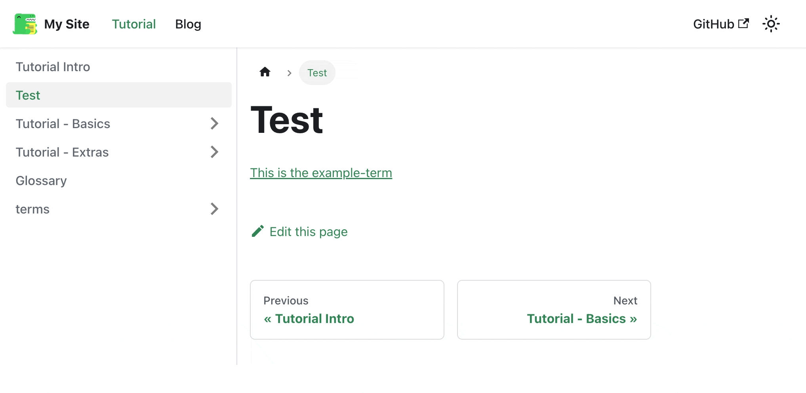

# @grnet/docusaurus-terminology

## Overview

This Docusaurus plugin allows you to use standout terms in your pages, which, when hovered over, displays a short explanation, and when clicked, navigates you to the relevant page. The plugin parses all `*.md` and `*.mdx` files and replaces each markdown hyperlink pattern with a `<a>` HTML tag supporting a tooltip functionality. Additionally, it generates a glossary with all terms found in the markdown files.



## Installation

To use this plugin, you have to add it to your project as a npm package. You can do this by running the following command in your project's root directory:

```
npm i @grnet/docusaurus-terminology --save
```

or

```
yarn add @grnet/docusaurus-terminology
```

Once the package is installed, you need to configure it in your Docusaurus site configuration file by adding the plugin to your `docusaurus.config.js` file:

```
module.exports = {
    ...
  plugins: [
    ['@grnet/docusaurus-terminology', {
      termsDir: './docs/terms',
      docsDir: './docs/',
      glossaryFilepath: './docs/glossary.md'
    }],
  ],
    ...
};
```

There is the ability to use custom components for the glossary file and term preview tooltip, instead of using the ones provided by `@grnet/docusaurus-term-preview` and `@grnet/docusaurus-glossary-view`.

To modify the default options, add the fields `glossaryComponentPath`, `termPreviewComponentPath` in the plugins section to provide the corresponding component paths:

```
plugins: [
    ['@grnet/docusaurus-terminology', {
      ...
      glossaryComponentPath: 'path/to/your/component',
      termPreviewComponentPath: 'path/to/your/component',
    }],
  ],
```

## Usage

To use the terminology tool, you need to create the terms folder under docs in order to have the required folder structure: `docs/terms`.

After that, you can create the `*.md` and `*.mdx` files and initialize them with the format of the following metadata header.

```
---
id: example-term
title: Example term
hoverText: This is an example term
---

This is a more detailed explanation for the term. The `hoverText` metadata provides a preview of the explanation.
```

You should also create a new `./docs/glossary.md` file.

```
---
id: glossary
title: Glossary
---

This is my glossary file, I expect this to remain unaltered, and just append text below this line.

```

To include the desired term in a documentation page, you can add the markdown syntax for a hyperlink `[term](path/to/term.md)` in the page. For example, you can edit the default `./docs/intro.md` generated by the Docusaurus scaffolder and add a link, eg. `[This is the example-term](./terms/example-term)`. You should make sure that the link you point to is relative to the path where the term source code file is located in your filesystem.

This renders the hyperlink "This is the example-term", and displays the "hoverText" attribute when you hover it.

## How it works
This plugin retrieves docs in two ways:

1. Parses all `*.md` and `*.mdx` files in the `docs/` directory and replaces each pattern `[term](path/to/term.md)` (markdown syntax for a hyperlink) with a `<a>` tag supporting tooltip functionality using the [@grnet/term-preview](https://www.npmjs.com/package/@grnet/docusaurus-term-preview) package that uses the [rc-tooltip](https://www.npmjs.com/package/rc-tooltip) under the hood.
2. Creates a glossary with all the terms from markdown files that are listed in the `docs/terms/`.

In greater depth:

#### Terms

The plugin needs the directory `docs/terms`, which contains all the terms you need for your website. The specific format for each term:

In `docs/terms/example-term.md`:

```
---
id: example-term
title: Example term
hoverText: This is an example term
---

Example body
```

where:

* `id`: the unique id of the docusaurus web page, this is docusaurus specific

* `title`: the visible title of the term, docusaurus specific as well

* `hoverText`: this text shows when you hover over a term in a documentation page

You can add your own content under the markdown metadata header.

#### Glossary

The plugin creates a glossary that aggregates all of the terms from the `docs/terms` directory onto a single page where you can examine each term and its `hoverText` definition. Also, you can click a term to go to the term page. To see the glossary page you can visit [http://localhost:3000/docs/glossary](http://localhost:3000/docs/glossary)

## Troubleshooting

If you encounter any issues with the @grnet/docusaurus-terminology plugin, please check the following:
* Ensure that you have installed it correctly and added it to your site configuration file.
* Make sure that you add/edit markdown files under the `/docs/terms` directory and the hyperlink pattern `[term](path/to/term.md)` you are using to define the term is correct. Both the term's id and filename must match.
* If you are still encountering issues, please submit a bug report or contact the plugin maintainer for support.

## Contributing

If you would like to contribute to the development of the @grnet/docusaurus-terminology plugin, you can do so by submitting issues or pull requests on the GitHub repository.

## License

The @grnet/docusaurus-terminology plugin is released under the BSD-2-Clause.

